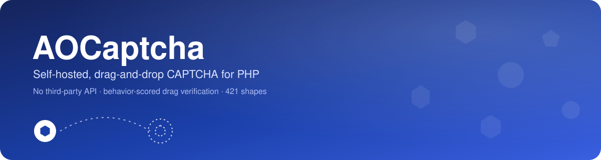
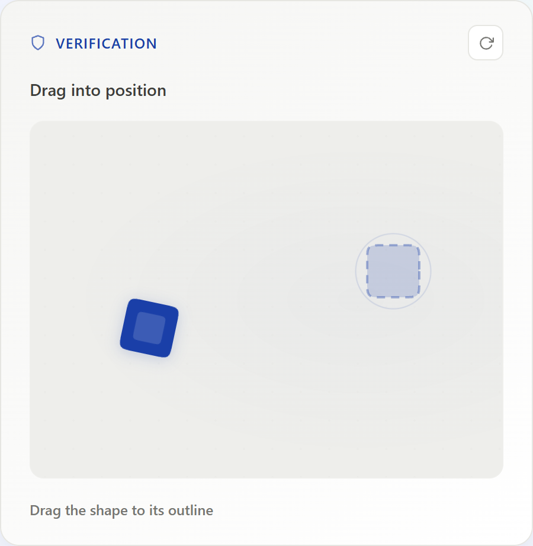
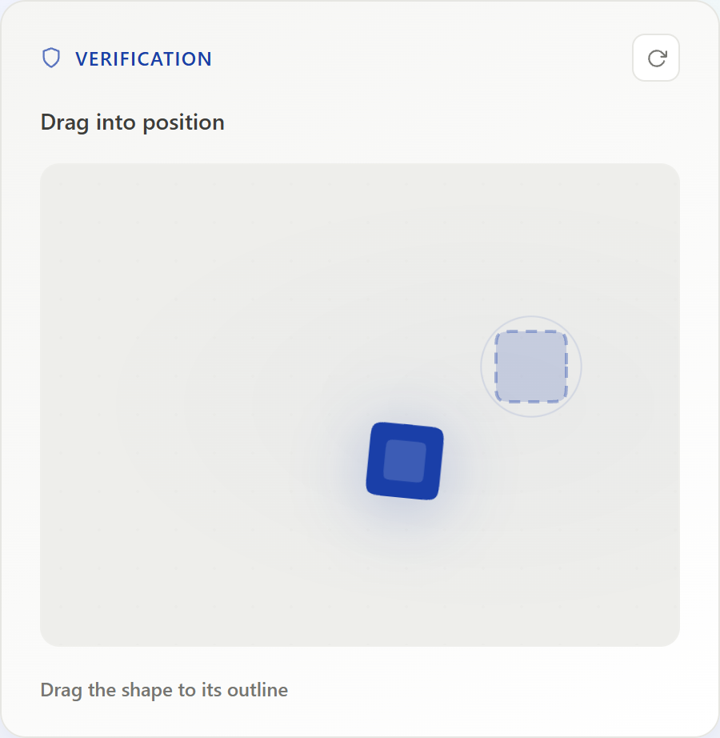
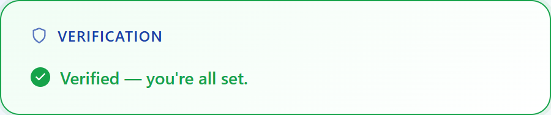
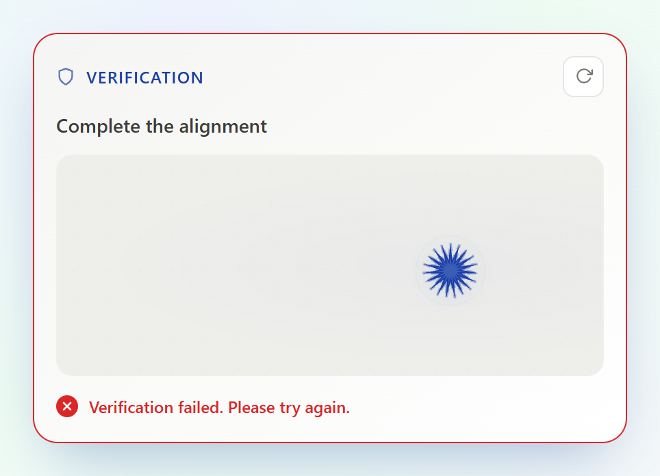
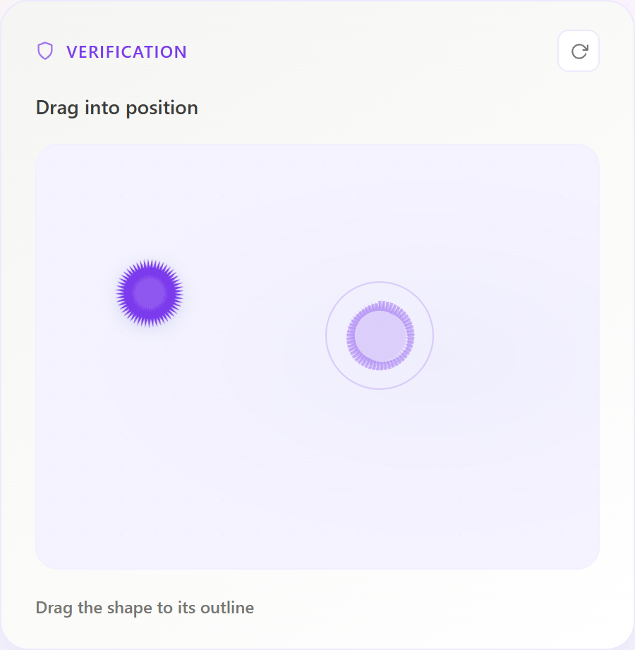
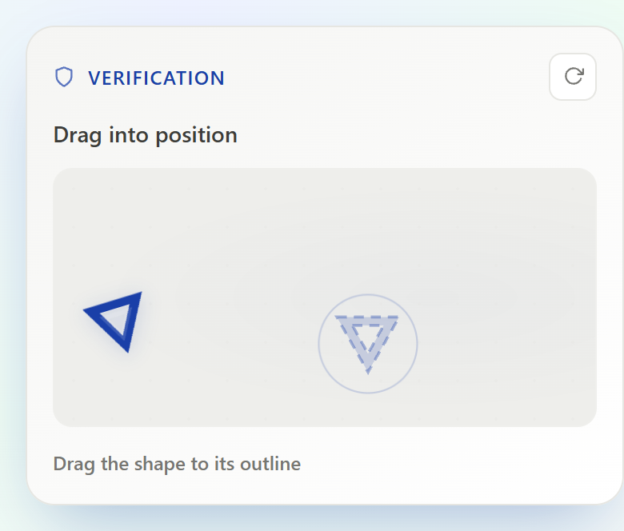
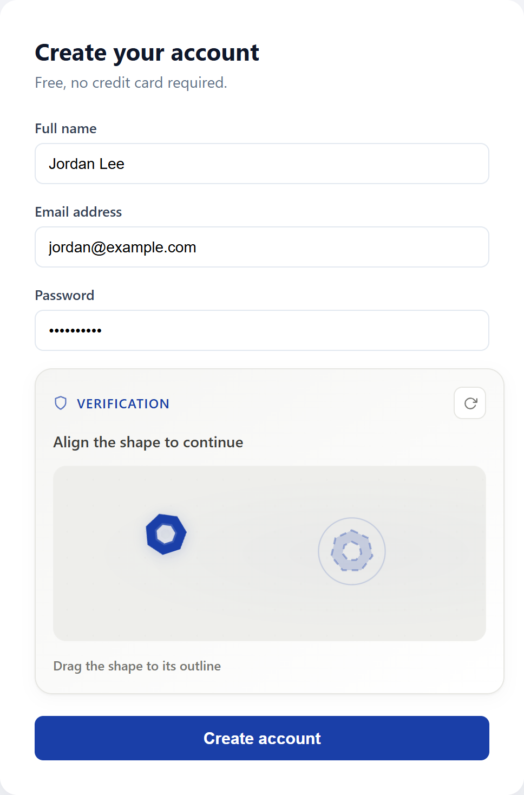
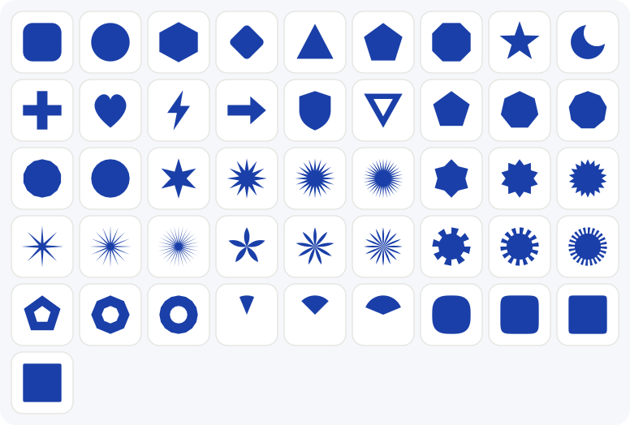

<p align="center">
  
</p>

<p align="center">
  <a href="LICENSE"></a>
  <a href="https://www.php.net/"></a>
  <a href="https://www.npmjs.com/package/@weanteomnio/aocaptcha"></a>
  
  
  
  
  
</p>

<p align="center">
  <b>AOCaptcha</b> is a self-hosted, open-source drag-and-drop CAPTCHA for PHP.
  Visitors drag a shape onto its matching outline instead of picking traffic
  lights out of a grid — and the server scores <i>how</i> they dragged it,
  not just where it landed.
</p>

<p align="center">
  No external API. No third-party script. No tracking cookie. No per-request
  billing. Just a Composer package and an npm package that run entirely on
  your own server.
</p>

---

## See it in action

<table>
<tr>
<td width="50%" align="center">
  
  <sub>Idle — waiting for the visitor to drag the piece</sub>
</td>
<td width="50%" align="center">
  
  <sub>Mid-drag — the target outline lights up as the piece gets close</sub>
</td>
</tr>
<tr>
<td width="50%" align="center">
  
  <sub>Verified — a genuine pass through real server-side bot detection</sub>
</td>
<td width="50%" align="center">
  
  <sub>Rejected — a scripted, dead-straight drag fails real bot scoring</sub>
</td>
</tr>
<tr>
<td width="50%" align="center">
  
  <sub>Themed at runtime via <code>AOCaptcha.init({ theme })</code></sub>
</td>
<td width="50%" align="center">
  
  <sub>Responsive down to a 390px mobile viewport</sub>
</td>
</tr>
</table>

<p align="center">
  
  <br>
  <sub>Dropped into a real signup form — no custom layout work required</sub>
</p>

Every screenshot above is a real capture: a real drag driven against the
actual running widget and PHP backend, including the "rejected" shot, which
is a genuine `BehaviorAnalyzer` failure on a scripted straight-line drag —
not a mockup.

## Why AOCaptcha?

Most CAPTCHA widgets either outsource your visitors' behavior to a third
party (reCAPTCHA, hCaptcha) or reduce to "click the checkbox," which
stopped meaningfully filtering bots years ago. AOCaptcha takes a third
path: run the whole thing — challenge, scoring, verification — on your own
server, and judge the *gesture*, not just the destination.

| | AOCaptcha | Typical third-party CAPTCHA |
|---|---|---|
| **Hosting** | Self-hosted, your server only | External SaaS |
| **Third-party network calls** | None | Yes, on every load/verify |
| **Verification signal** | Drop position *and* movement pattern | Usually position/click only |
| **Visual style** | One JSON file, fully yours | Fixed widget chrome |
| **Shape/puzzle pool** | 421 shapes, extensible | N/A |
| **Cost** | Free, open source | Often metered per verification |
| **Dependencies** | Plain PHP 8.1+ and vanilla JS | SDK/script per vendor |

## Table of contents

- [How it works](#how-it-works)
- [Features](#features)
- [Install](#install)
- [Usage](#usage)
- [Customization](#customization)
- [Shape gallery](#shape-gallery)
- [Security](#security)
- [Storage adapters](#storage-adapters)
- [Testing](#testing)
- [FAQ](#faq)
- [Contributing](#contributing)
- [Credits & attribution](#credits--attribution)
- [License](#license)

## How it works

```
 1. CHALLENGE          2. DRAG                 3. SNAP              4. VERIFY
 ┌───────────┐        ┌───────────┐          ┌───────────┐        ┌───────────┐
 │  ◆  ·  ○  │  --->  │  ·  ·  ◆→ │   --->   │  ·  ·  ◆  │  --->  │  ✓ or ✗   │
 │ (server   │        │ (x,y,t    │          │ (within   │        │ (position │
 │  picks    │        │  samples  │          │  tolerance,│        │  + motion │
 │  target)  │        │  recorded)│          │  auto-fire)│        │  checked) │
 └───────────┘        └───────────┘          └───────────┘        └───────────┘
```

1. **Challenge.** The server (`Challenge::generate()`) picks a random
   shape, target position, starting position, and rotation, and stores the
   answer server-side keyed to the visitor's session. The client only ever
   receives coordinates to render — never the "correct answer" in a form a
   bot could just replay.
2. **Drag.** The visitor drags the rotated piece across the arena. The
   widget records `{x, y, t}` samples (throttled to roughly one every
   25ms) for the *entire* gesture, not just the drop point.
3. **Snap.** Once the piece is within tolerance of the target, it snaps
   into place and the client sends the full movement trace to the verify
   endpoint.
4. **Verify.** `CaptchaHandler` re-checks the drop position against the
   *server-stored* target, then hands the movement trace to
   `BehaviorAnalyzer::looksHuman()`, which scores the gesture itself:
   - total path length vs. straight-line distance (real hands rarely move
     in a perfect line)
   - speed variance across the gesture (constant instantaneous speed reads
     as synthetic)
   - direction changes in the final approach (humans overshoot and correct)
   - micro-jitter / acceleration noise

   Only a drop that is both **positionally correct** and **behaviorally
   human** gets a one-time verification token. The screenshot above
   showing a red "Verification failed" is exactly this check catching a
   scripted, perfectly-straight drag.
5. **Submit.** The token rides along as a hidden form field; your own
   server-side code checks it with `CaptchaHandler::verifyPass()` before
   accepting the submission.

## Features

- **Drag-and-drop challenge** — rotate-and-align interaction instead of
  image classification, readable at a glance on desktop and touch.
- **Movement-pattern bot detection** — `BehaviorAnalyzer` scores path
  curvature, speed variance, and direction changes; see
  [How it works](#how-it-works).
- **421 built-in shapes** across 9 shape families, plus a JSON config to
  add your own — see [Shape gallery](#shape-gallery).
- **One config file for everything visual** — shapes, accent/background
  colors, fonts, corner radii, and widget/piece sizing live in
  `aocaptcha.config.json`.
- **Runtime theme overrides** via `AOCaptcha.init({ theme: {...} })`, for
  per-tenant styling decided in JS without touching the config file.
- **Responsive by design** — every CSS dimension is a custom property, so
  a narrow-viewport override (shown above) is a one-line theme change.
- **Pluggable storage** — ships with a session-based store and a Redis
  store for stateless/multi-server deployments; implement
  `StorageInterface` for anything else.
- **No external services** — no CAPTCHA-solving API, no analytics beacon,
  nothing phoning home.
- **No framework dependency** — plain PHP 8.1+ and vanilla JS (UMD + ESM
  builds); drop two files into any stack.
- **Resilient endpoint headers** — the bundled `handleRequest()` sends
  explicit no-store/no-cache headers so CDNs and reverse proxies never
  cache a stale challenge.

## Install

**Composer (PHP):**

```bash
composer require weanteomnio/aocaptcha
```

**npm (JS/CSS):**

```bash
npm install @weanteomnio/aocaptcha
```

**Or, drop-in (no build tools):** copy `src/js/aocaptcha.js`,
`src/css/aocaptcha.css`, and `src/php/**` directly into your project.

## Usage

1. Create an endpoint file your frontend will call:

```php
<?php
require 'vendor/autoload.php';

use weanteomnio\AOCaptcha\Http\CaptchaHandler;
use weanteomnio\AOCaptcha\Storage\SessionStorage;

(new CaptchaHandler(new SessionStorage()))->handleRequest();
```

2. In your form's HTML, add a container and point it at that endpoint:

```html
<link rel="stylesheet" href="/vendor/weanteomnio/aocaptcha/dist/aocaptcha.min.css">

<form method="post">
  <div data-ao-captcha data-ao-captcha-endpoint="/captcha-endpoint.php"></div>
  <button type="submit">Submit</button>
</form>

<script src="/vendor/weanteomnio/aocaptcha/dist/aocaptcha.umd.js"></script>
```

The widget appends a hidden `_captcha_answer` input to the form once
solved; your form won't submit until it's verified client-side.

3. On your form's own submit handler, check the token server-side:

```php
<?php
use weanteomnio\AOCaptcha\Http\CaptchaHandler;
use weanteomnio\AOCaptcha\Storage\SessionStorage;

$handler = new CaptchaHandler(new SessionStorage());
if (!$handler->verifyPass($_POST['_captcha_answer'] ?? '')) {
    // reject the submission
}
```

See `demo/` for a complete, runnable example
(`php -S localhost:8080 -t demo demo/router.php`, from the repo root — the
router lets the dev server expose the sibling `dist/` build output that
the demo page links to).

## Customization

Shapes, colors, font, and sizing are all controlled from one file at the
package root: **`aocaptcha.config.json`**.

```json
{
  "shapes": { "circle": "<circle cx=\"26\" cy=\"26\" r=\"22\"/>", "...": "..." },
  "theme": { "accent": "#1a3fa8", "fontFamily": "inherit", "pieceSize": "52px", "...": "..." }
}
```

- **`shapes`** — maps shape name to inner SVG markup. Add, remove, or edit
  entries here. `Challenge` (PHP) reads this file directly to pick the
  default shape pool, and `npm run build` injects the same map into
  `dist/aocaptcha.umd.js` / `dist/aocaptcha.esm.js` for rendering. See
  [Shape gallery](#shape-gallery) for the full built-in set.
- **`theme`** — the default values for every themeable CSS custom property
  (`--color-accent`, `--font-family`, `--radius-*`, `--arena-height`,
  `--piece-size`, etc. — see the top of `src/css/aocaptcha.css` for the
  full set). Edit a value and rebuild; no JS required.

After editing the file, run `npm run build` to regenerate `dist/`. The raw
`src/js/aocaptcha.js` also carries a copy of the shipped defaults as a
fallback for drop-in use without a build step.

For themes that need to change at runtime (e.g. per-tenant styling decided
in JS, or a responsive override like the mobile screenshot above), layer
an override on top of the config file's defaults with
`AOCaptcha.init({ theme: {...} })`:

```html
<script src="/vendor/weanteomnio/aocaptcha/dist/aocaptcha.umd.js"></script>
<script>
  AOCaptcha.init({ theme: { accent: '#7c3aed', radiusXl: '20px' } });
</script>
```

Call `init()` in a plain (non-deferred) `<script>` placed right after the
widget's own `<script>` tag, so it runs before the library's automatic
`DOMContentLoaded` init — otherwise the containers will already be
initialized with the config file's theme. `init()` applies its theme as
inline styles on each `[data-ao-captcha]` container, so it wins over both
the stylesheet and the config file's defaults. The purple screenshot above
is exactly this: `accent`, `accentMuted`, backgrounds, radii, and
`pieceSize` overridden at runtime, no CSS edits involved.

Available `theme` keys (same set in the config file and `init()`):

| Key | CSS variable | Controls |
|---|---|---|
| `accent`, `accentMuted` | `--color-accent`, `--color-accent-muted` | brand/accent color |
| `bgMuted`, `bgSoft`, `surface` | `--color-bg-muted`, `--color-bg-soft`, `--color-surface` | backgrounds |
| `border`, `borderSoft` | `--color-border`, `--color-border-soft` | borders |
| `danger`, `success` | `--color-danger`, `--color-success` | error/success states |
| `text2`, `text3`, `text4` | `--color-text-2/3/4` | text colors (darkest to lightest) |
| `fontFamily` | `--font-family` | widget font |
| `fontSize`, `fontSizeSmall` | `--text-sm`, `--text-xs` | prompt text size / status & brand text size |
| `radiusFull`, `radiusLg`, `radiusMd`, `radiusXl` | `--radius-*` | corner rounding |
| `width`, `maxWidth` | `--width`, `--max-width` | overall widget box size |
| `arenaHeight` | `--arena-height` | drag-surface height |
| `pieceSize` | `--piece-size` | puzzle piece / target size (applies above 640px; a smaller fixed size is used on narrow viewports) |

## Shape gallery

<p align="center">
  
</p>

AOCaptcha ships with **421 shapes** across 9 parametric families, so the
same challenge rarely repeats the exact same silhouette. 15 are hand-drawn
one-offs (`circle`, `heart`, `shield`, `moon`, …); the rest are generated
by sweeping a single parameter through a formula, which is also how you'd
extend the pool yourself in `aocaptcha.config.json`:

| Family | Range | Shape |
|---|---|---|
| `polygon-N` | 3–60 | regular N-sided polygon |
| `star-N` | 4–59 | N-pointed star |
| `gear-N` | 4–59 | N-tooth pointed gear/star |
| `burst-N` | 4–39 | sharp N-spike burst/sparkle |
| `flower-N` | 3–45 | N rounded petals around a center |
| `cog-N` | 4–45 | N flat-top gear teeth |
| `ring-N` | 3–45 | N-sided donut/annulus outline |
| `sector-N` | 15–175 (step 5) | pie-slice wedge, N = angle in degrees |
| `squircle-N` | 2–40 | superellipse from circle (N=2) to near-square (N=40) |

`Challenge::defaultShapeNames()` reads the shape pool straight from the
config file, so the PHP side scales to however many shapes the file
contains — add a 422nd shape and it's in the rotation with no code change.

## Security

- **Server-authoritative target.** The correct drop position lives only in
  server-side storage, keyed to the visitor's session/browser ID. The
  client only ever receives render coordinates, never anything a scripted
  client could replay to "know" the answer in advance.
- **Behavioral verification, not just position.** See
  [How it works](#how-it-works) — a positionally-correct but
  mechanically-straight drag is rejected by `BehaviorAnalyzer`, exactly as
  shown in the rejected-drag screenshot above.
- **One-time tokens.** `verifyPass()` deletes the stored pass token on
  first read (`hash_equals` for the comparison), so a token can't be
  reused across two submissions.
- **Short-lived state.** Challenges expire after 5 minutes and pass tokens
  after 10 (`CaptchaHandler::CHALLENGE_TTL` / `PASS_TTL`), so stale
  challenges and tokens can't accumulate indefinitely in storage.
- **No-cache response headers.** `handleRequest()` sends explicit
  `Cache-Control`, `Pragma`, `Expires`, and CDN/surrogate-control headers
  so a reverse proxy or CDN never serves a cached challenge to a different
  visitor.
- **No third-party network calls.** Nothing in the verification path
  contacts an external service, so there's no vendor outage, API quota,
  or third-party data-sharing concern to evaluate.

## Storage adapters

- `weanteomnio\AOCaptcha\Storage\SessionStorage` — default, uses
  `$_SESSION`. No extra setup.
- `weanteomnio\AOCaptcha\Storage\RedisStorage` — for stateless/multi-server
  deployments. Requires `ext-redis`. Pass a connected `\Redis` instance:

```php
$redis = new Redis();
$redis->connect('127.0.0.1');
$handler = new CaptchaHandler(new RedisStorage($redis));
```

When using `RedisStorage`, pass an explicit `$browserId` (e.g. your own
session or auth identifier) as the third argument to `handle()` and
`verifyPass()`, since there's no PHP session to derive one from
automatically.

Need a different backend (Memcached, a database table, …)? Implement
`weanteomnio\AOCaptcha\Storage\StorageInterface` (`get`, `set`, `delete`)
and pass your class in instead.

## Testing

```bash
composer install
vendor/bin/phpunit
```

21 tests / 653 assertions, covering challenge generation, shape-pool
loading from `aocaptcha.config.json`, storage adapters, and
`BehaviorAnalyzer`'s scoring thresholds. There's no JS test runner yet —
contributions adding one are welcome (see [Contributing](#contributing)).

## FAQ

**Is AOCaptcha a replacement for Google reCAPTCHA or hCaptcha?**
For self-hosted projects that want to avoid a third-party dependency, yes.
It solves the same problem — distinguishing a human submission from a
scripted one — without an external API call, API key, or usage quota.

**Does it require a database?**
No. The default `SessionStorage` uses PHP's built-in session handling.
`RedisStorage` is available for multi-server deployments where sessions
aren't shared.

**Does it work on mobile and touch devices?**
Yes — the widget listens for both mouse and touch events
(`touchstart`/`touchmove`/`touchend`) for the drag interaction, and every
dimension is a CSS custom property, so it can be made fully responsive
with a one-line theme override (see the mobile screenshot above).

**Is it accessible to keyboard-only users?**
Not yet — the drag interaction currently has no keyboard-operable
fallback. This is an open area for contribution; see
[Contributing](#contributing).

**Can I add my own shapes or change the colors?**
Yes. Both live in one file, `aocaptcha.config.json` — see
[Customization](#customization).

**Does AOCaptcha send any data to a third party?**
No. Challenge generation, movement scoring, and verification all happen
in your own PHP process against your own storage backend.

**Can I run multiple AOCaptcha widgets on one page?**
Yes — `initCaptchas()` initializes every `[data-ao-captcha]` container on
the page independently and skips any container already initialized.

**What happens if a visitor fails the drag?**
The widget calls `fetchChallenge()` again and issues a fresh challenge —
failed attempts don't lock the visitor out, they just get a new shape to
align.

## Contributing

Issues and pull requests are welcome. Please run the PHPUnit suite
(`vendor/bin/phpunit`) and `npm run build` before opening a PR, and keep
changes focused. Bug reports that include the PHP version, browser, and
steps to reproduce are the easiest to act on.

## Credits & attribution

AOCaptcha is open source under the GPLv3. If you ship it as part of your
own project, a star on the repo or a mention of where it's running is
genuinely appreciated:

> Powered by [AOCaptcha](https://github.com/weanteomnio/AOCaptcha) by Suman Banerjee.

## License

Released under the [GNU General Public License v3.0](LICENSE). Copyright
© 2026 Suman Banerjee.

GPLv3 is a copyleft license: if you distribute a modified version of
AOCaptcha itself (not just a project that *uses* it), that modified
version must also be released under GPLv3 with source available. See the
[LICENSE](LICENSE) file for the full terms.
